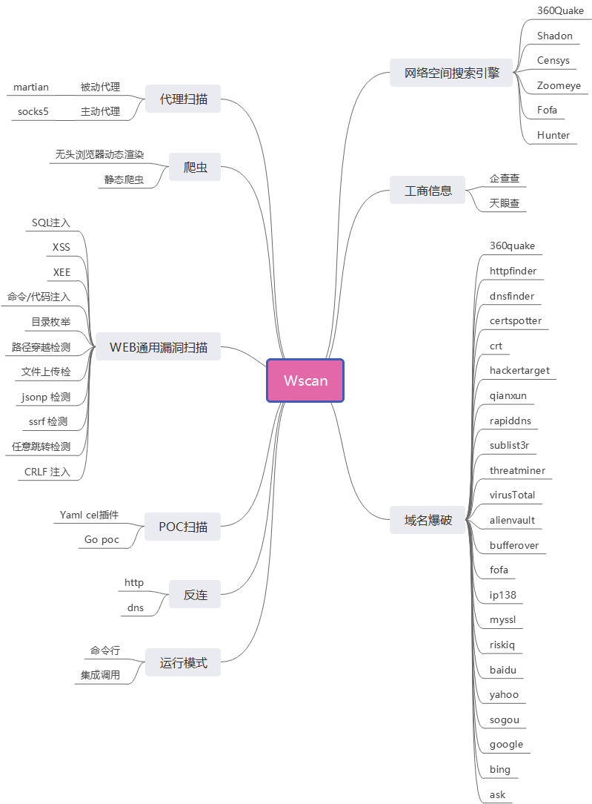

# wscan
Wscan是一款专注于WEB安全的扫描器，它向Nmap致敬，而Nmap已经开源25年了。我们也计划在未来25年内持续更新Wscan，并将其持续开源。我们欢迎所有对web安全感兴趣的人一起加入我们的开发团队。

我们的目标是开发一款使用机器学习进行渗透测试的工具。与其他工具不同的是，我们的工具可以自动学习攻击和防御的模式，并根据具体的目标进行个性化的攻击。这样一来，我们的攻击效率和准确性将大大提高，同时也能降低误判的概率。

我们的工具采用了机器学习技术，实现了全自动化的Web渗透测试。这意味着无需手动添加和更新规则和签名，它能够自动学习和适应新的攻击模式和漏洞。

机器学习技术还能够快速处理大量的数据和流量，从而大幅提高测试效率和准确性。此外，它能够识别和发现一些人工难以察觉的漏洞和弱点，从而改善测试质量和可靠性。

我们相信，使用机器学习技术进行渗透测试，将是未来网络安全的一个重要方向。我们希望我们的工具能够帮助更多的人保障网络安全，为网络安全事业做出贡献。

# 项目进展
很高兴地宣布，基于事件订阅WEB通用插件调度和HTTP参数形变模块已经完成了开发工作，同时，动态漏扫爬虫也已经完成了。一旦项目在GitHub上获得超过300个星星，将其全部开源。 
在此之前，开始接收第三方提取的WEB通用插件代码，希望能够与更多的开发者们一起合作，共同完善Wscan，为用户提供更好的服务。欢迎您的参与和贡献！
具体请参考《WEB通用漏扫插件编写指南.md》,直接提交PR即可，保证一天内回复。

2023.04.22 完成了基于消息订阅的插件调度模块，可以完成简单的扫描功能 (Stars > 300 解锁)

# TODO:
传统的扫描部分采用了Golang语言重新实现了xray，并将其开源。未来的扫描部分将采用机器学习技术，旨在构建更为先进的扫描器。   

2023.08.30 完成WEB通用漏洞扫描插件  
2023.10.30 完成通过机器学习降低误报  
202X.XX.XX 使用机器学习构建Payload进行自动化扫描  
# 架构简析


# 参考代码：
goml机器学习库 :https://github.com/cdipaolo/goml  
被动扫描 https://github.com/zema1/martian  
被动扫描 https://github.com/lqqyt2423/go-mitmproxy  
POC扫描  https://github.com/jweny/pocassist   
POC扫描  https://github.com/WAY29/pocV   
POC扫描  https://github.com/zema1/yarx  
动态爬虫 https://github.com/Qianlitp/crawlergo  
基础爬虫 https://github.com/geziyor/geziyor   
基础爬虫 https://github.com/gocolly/colly  
SQL注入 https://github.com/sqlmapproject/sqlmap  
OWASP TOP10检测 https://github.com/andresriancho/w3af  
XSS 检测 https://github.com/hahwul/dalfox  
网站技术  https://github.com/chushuai/wappalyzer   
用Golang运行JavaScript https://github.com/dop251/goja  
反连平台 https://github.com/chennqqi/godnslog   
WEB漏洞扫描器：https://github.com/wrenchonline/glint  
JSONP劫持漏洞检测 https://github.com/jweny/check_jsonp_based_on_ast  
子域名爆破 https://github.com/projectdiscovery/subfinder/  
OWASP Cornucopia: 这是一个由OWASP（开放Web应用程序安全项目）开发的开源项目，它使用机器学习算法自动化检测Web应用程序中的漏洞。  
RIPS Technologies: 这是一个开源的PHP漏洞扫描器，使用机器学习算法自动化检测PHP应用程序中的漏洞。  
TensorFlow.js: 这是一个由Google开发的JavaScript机器学习库，可以用于检测Web应用程序中的漏洞和攻击。  
Wfuzz: 这是一个开源的Web应用程序漏洞扫描器，使用机器学习算法自动化检测Web应用程序中的漏洞和攻击。
# 攻击数据集

OWASP SQL Injection Dataset: 由 OWASP 组织提供的公开数据集，包括 12 个文件，共计 1000 个 SQL 注入攻击和 1000 个正常查询。该数据集可用于评估 SQL 注入攻击检测系统的性能。
OWASP SQL Injection Dataset: https://github.com/OWASP/SQLi-labs/tree/master/SQLi-001

Sqli-Labs: 包括一系列关于 SQL 注入攻击和检测的实验室，包括多种不同的注入类型和攻击方式。
Sqli-Labs: https://github.com/Audi-1/sqli-labs

WAF-FLE: 由 ModSecurity 团队提供的公开数据集，包括 230 多个不同的注入攻击和 300 多个正常查询。该数据集可用于评估 WAF 的性能和准确性
WAF-FLE: https://github.com/SpiderLabs/owasp-modsecurity-crs/tree/v3.4/dev/util/waf_fle/samples

XSS Data Sets: 由 WASC 提供的公开数据集，包括多种不同类型的 XSS 攻击和正常请求。该数据集旨在帮助测试和评估 Web 应用程序防御 XSS 攻击的能力。
XSS Data Sets: https://projects.webappsec.org/Document/Download/1

XSS_Test_Corpus: 由 Google 提供的公开数据集，包括多种不同类型的 XSS 攻击和正常请求。该数据集旨在帮助测试和评估 XSS 检测系统的性能。
XSS_Test_Corpus: https://storage.googleapis.com/xss-game/xss-test-cases.json

XSS Game: 由 Google 提供的在线 XSS 攻击训练平台，包括多个级别的挑战和练习，涵盖了各种不同类型的 XSS 攻击和防御技术。
Google的XSS Game平台地址是：https://xss-game.appspot.com/
# 参考文章
推开 xray 之门 https://koalr.me/posts/a-tour-of-xray/  
HTTP 被动代理的那些事 https://koalr.me/posts/passive-scan-via-http-proxy/  
JSONP https://securitycafe.ro/2017/01/18/practical-jsonp-injection/
# 使用文档参考
xray 安全评估工具文档  https://docs.xray.cool/#/  
pocsuite3  https://pocsuite.org/guide/poc-specification.html


# 以下是一些公开的 XSS 攻击数据集的下载链接
XSS Data Sets: https://projects.webappsec.org/Document/Download/1
XSS_Test_Corpus: https://storage.googleapis.com/xss-game/xss-test-cases.json


# 目录结构
```
├── core
│   ├── assassin
│   │   ├── collector
│   │   │   ├── basiccrawler
│   │   │   │   └── basic_crawler.go
│   │   │   ├── burp.go
│   │   │   ├── config.go
│   │   │   ├── dummy.go
│   │   │   ├── mitm.go
│   │   │   ├── mitmhelper
│   │   │   │   ├── basic_auth.go
│   │   │   │   ├── encoding.go
│   │   │   │   ├── httpmirror.go
│   │   │   │   ├── ip_source.go
│   │   │   │   ├── webctrl_data.go
│   │   │   │   ├── webctrl.go
│   │   │   │   └── websocket.go
│   │   │   ├── request.go
│   │   │   ├── service-list.go
│   │   │   └── url-list.go
│   │   ├── ctrl
│   │   │   ├── bus.go
│   │   │   ├── config.go
│   │   │   ├── dispatcher.go
│   │   │   └── runner.go
│   │   ├── dev
│   │   │   └── license
│   │   │       └── license.go
│   │   ├── entry
│   │   │   ├── config.go
│   │   │   ├── convert.go
│   │   │   ├── entry.go
│   │   │   ├── genca.go
│   │   │   ├── reverse.go
│   │   │   ├── service_scan.go
│   │   │   ├── subdomain.go
│   │   │   ├── upgrade.go
│   │   │   ├── utils.go
│   │   │   └── webscan.go
│   │   ├── http
│   │   │   ├── client.go
│   │   │   ├── config.go
│   │   │   ├── cookie.go
│   │   │   ├── flow.go
│   │   │   ├── param.go
│   │   │   ├── request.go
│   │   │   ├── resource.go
│   │   │   ├── response.go
│   │   │   ├── statistics.go
│   │   │   └── utils.go
│   │   ├── main.go
│   │   ├── model
│   │   │   └── vuln.go
│   │   ├── output
│   │   │   ├── html_data.go
│   │   │   ├── htmlfile.go
│   │   │   ├── stdout.go
│   │   │   └── webhook.go
│   │   ├── plugins
│   │   │   ├── base
│   │   │   │   ├── bifrost.go
│   │   │   │   ├── config.go
│   │   │   │   └── plugin.go
│   │   │   ├── baseline
│   │   │   │   ├── baseline.go
│   │   │   │   ├── cookie.go
│   │   │   │   ├── cors.go
│   │   │   │   ├── header.go
│   │   │   │   ├── host_injection.go
│   │   │   │   ├── redirect.go
│   │   │   │   ├── sensitive_info.go
│   │   │   │   ├── serialization.go
│   │   │   │   ├── server_error.go
│   │   │   │   ├── ssl.go
│   │   │   │   └── unsafe_scheme.go
│   │   │   ├── bruteforce
│   │   │   │   ├── basicauth.go
│   │   │   │   ├── bruteforce_finger_community.go
│   │   │   │   ├── bruteforce.go
│   │   │   │   ├── data.go
│   │   │   │   ├── dvwa.go
│   │   │   │   └── formbrute_community.go
│   │   │   ├── cmd_injection
│   │   │   │   ├── cmd_injection.go
│   │   │   │   ├── expression.go
│   │   │   │   ├── generic.go
│   │   │   │   ├── payload.go
│   │   │   │   ├── phpcode.go
│   │   │   │   └── template.go
│   │   │   ├── crlf_injection
│   │   │   │   └── crlf_injection.go
│   │   │   ├── dirscan
│   │   │   │   ├── backup.go
│   │   │   │   ├── compare.go
│   │   │   │   ├── dirscan_data.go
│   │   │   │   ├── dirscan.go
│   │   │   │   ├── sourcemap.go
│   │   │   │   └── yaml.go
│   │   │   ├── fastjson
│   │   │   │   ├── deserialization.go
│   │   │   │   └── fastjson.go
│   │   │   ├── helper
│   │   │   │   ├── expr
│   │   │   │   │   ├── CustomInt.go
│   │   │   │   │   ├── element.go
│   │   │   │   │   ├── expr.go
│   │   │   │   │   ├── Origin.go
│   │   │   │   │   ├── OriginNumberToExpr.go
│   │   │   │   │   ├── OriginNumberToHex.go
│   │   │   │   │   ├── RandInt.go
│   │   │   │   │   ├── RandStr.go
│   │   │   │   │   ├── SleepTime.go
│   │   │   │   │   └── Space.go
│   │   │   │   ├── expression
│   │   │   │   │   ├── expression.go
│   │   │   │   │   └── types.go
│   │   │   │   ├── knowledge
│   │   │   │   │   └── know.go
│   │   │   │   └── seeyon
│   │   │   │       └── encode.go
│   │   │   ├── jsonp
│   │   │   │   ├── jsonp.go
│   │   │   │   └── parser.go
│   │   │   ├── path_traversal
│   │   │   │   ├── path_traversal.go
│   │   │   │   └── payloads.go
│   │   │   ├── phantasm
│   │   │   │   ├── loader.go
│   │   │   │   ├── phantasm.go
│   │   │   │   ├── pocs
│   │   │   │   │   └── gopoc
│   │   │   │   │       ├── ecology-dbconfig-info-leak.go
│   │   │   │   │       ├── poc_community.go
│   │   │   │   │       ├── seeyon-htmlofficeservlet-rce.go
│   │   │   │   │       ├── tomcat-cve-2020-1938.go
│   │   │   │   │       ├── tomcat-put.go
│   │   │   │   │       ├── tongda-arbitrarily-auth.go
│   │   │   │   │       └── tongda-lfi-upload-rce.go
│   │   │   │   ├── yaml_finger.go
│   │   │   │   └── yaml_poc_data.go
│   │   │   ├── plugins.go
│   │   │   ├── redirect
│   │   │   │   ├── redirect.go
│   │   │   │   └── script.go
│   │   │   ├── shiro
│   │   │   │   ├── default.go
│   │   │   │   ├── deserialization.go
│   │   │   │   └── shiro.go
│   │   │   ├── sql_injection
│   │   │   │   ├── sqli_detector
│   │   │   │   │   ├── db_error.go
│   │   │   │   │   ├── detector.go
│   │   │   │   │   └── sqli_payload
│   │   │   │   │       ├── base.go
│   │   │   │   │       ├── booleaned_based.go
│   │   │   │   │       ├── error_based.go
│   │   │   │   │       └── time_based.go
│   │   │   │   └── sql_injection.go
│   │   │   ├── ssrf
│   │   │   │   ├── payload.go
│   │   │   │   └── ssrf.go
│   │   │   ├── struts
│   │   │   │   ├── devmode.go
│   │   │   │   ├── ognl.go
│   │   │   │   ├── s2-005.go
│   │   │   │   ├── s2-007.go
│   │   │   │   ├── s2-009.go
│   │   │   │   ├── s2-013.go
│   │   │   │   ├── s2-015.go
│   │   │   │   ├── s2-016.go
│   │   │   │   ├── s2-032.go
│   │   │   │   ├── s2-037.go
│   │   │   │   ├── s2-045.go
│   │   │   │   ├── s2-046.go
│   │   │   │   ├── s2-052.go
│   │   │   │   ├── s2-057.go
│   │   │   │   └── struts.go
│   │   │   ├── thinkphp
│   │   │   │   ├── invoke_rce.go
│   │   │   │   ├── method_rce.go
│   │   │   │   ├── preg_rce.go
│   │   │   │   ├── sqli.go
│   │   │   │   ├── thinkphp.go
│   │   │   │   └── v6_filewrite.go
│   │   │   ├── upload
│   │   │   │   ├── payloads.go
│   │   │   │   └── upload.go
│   │   │   ├── xss
│   │   │   │   ├── element.go
│   │   │   │   ├── helper.go
│   │   │   │   ├── js
│   │   │   │   │   ├── esprima.go
│   │   │   │   │   └── parser.go
│   │   │   │   ├── pos_script.go
│   │   │   │   ├── pos_style.go
│   │   │   │   ├── pos_tag.go
│   │   │   │   ├── pos_text.go
│   │   │   │   ├── query_response.go
│   │   │   │   ├── request_builder.go
│   │   │   │   └── xss.go
│   │   │   └── xxe
│   │   │       ├── blind.go
│   │   │       ├── echo.go
│   │   │       ├── payloads.go
│   │   │       └── xxe.go
│   │   ├── resource
│   │   │   └── service.go
│   │   ├── reverse
│   │   │   ├── api_base.go
│   │   │   ├── cland
│   │   │   │   └── cland_data.go
│   │   │   ├── config.go
│   │   │   ├── conn.go
│   │   │   ├── db.go
│   │   │   ├── dns_server.go
│   │   │   ├── fetch.go
│   │   │   ├── group.go
│   │   │   ├── http_server.go
│   │   │   ├── payload_template.go
│   │   │   ├── reverse.go
│   │   │   ├── rmi_server.go
│   │   │   └── server.go
│   │   └── utils
│   │       ├── buildinfo
│   │       │   ├── info.go
│   │       │   ├── oui_data.go
│   │       │   └── update.go
│   │       ├── case_insensitive.go
│   │       ├── cert.go
│   │       ├── comparer
│   │       │   ├── header.go
│   │       │   ├── htmlcompare
│   │       │   │   └── compare.go
│   │       │   ├── response.go
│   │       │   └── strcompare
│   │       │       ├── compare.go
│   │       │       └── utils.go
│   │       ├── cusctx
│   │       │   └── ctx.go
│   │       ├── file.go
│   │       ├── guess
│   │       │   ├── guess.go
│   │       │   ├── response.go
│   │       │   └── value.go
│   │       ├── math.go
│   │       ├── network.go
│   │       ├── print.go
│   │       ├── rand.go
│   │       ├── rlimit
│   │       │   └── file.go
│   │       ├── string.go
│   │       ├── sync.go
│   │       ├── tamper.go
│   │       ├── test.go
│   │       ├── time.go
│   │       ├── url.go
│   │       └── ysoserial
│   │           ├── Gadgets
│   │           │   ├── CommonsBeanutils1.go
│   │           │   ├── CommonsBeanutils2.go
│   │           │   ├── CommonsCollectionsK1.go
│   │           │   ├── CommonsCollectionsK2.go
│   │           │   ├── gadget.go
│   │           │   ├── Jdk7u21.go
│   │           │   └── Jdk8u20.go
│   │           └── ysoserial.go
│   ├── rpc
│   │   └── pb
│   │       └── gunkit.pb.go
│   └── utils
│       ├── checker
│       │   ├── error.go
│       │   ├── filter
│       │   │   ├── badger_filter.go
│       │   │   └── sync_map_filter.go
│       │   ├── matcher
│       │   │   ├── glob_matcher.go
│       │   │   ├── hostname_matcher.go
│       │   │   ├── interface.go
│       │   │   ├── key_matcher.go
│       │   │   ├── port_matcher.go
│       │   │   └── regexp_matcher.go
│       │   ├── request_checker.go
│       │   ├── service_checker.go
│       │   ├── url_checker.go
│       │   └── util.go
│       ├── collections
│       │   └── queue.go
│       ├── config.go
│       ├── connection.go
│       ├── domainutil.go
│       ├── host_n_port_utils.go
│       ├── http_utils.go
│       ├── log
│       │   ├── config.go
│       │   └── log.go
│       ├── network
│       │   └── network.go
│       ├── os_utils.go
│       ├── printer
│       │   ├── base.go
│       │   ├── console.go
│       │   ├── json.go
│       │   ├── multi.go
│       │   ├── nice
│       │   │   └── color.go
│       │   └── text.go
│       ├── rand_utils.go
│       └── str_utils.go
├── doc
│   ├── xray_dep.txt
│   ├── xray_file.md
│   └── xray.md
├── ext
│   ├── crawler
│   │   ├── analysis_page.go
│   │   ├── basic_task_hander.go
│   │   ├── body.go
│   │   ├── browser_task_hander.go
│   │   ├── check_url.go
│   │   ├── chrome_util.go
│   │   ├── client.go
│   │   ├── config.go
│   │   ├── crawer.go
│   │   ├── filter.go
│   │   ├── js
│   │   │   └── js.go
│   │   └── util.go
│   ├── fastdomain
│   │   ├── datasource
│   │   │   ├── alienvault.go
│   │   │   ├── ask.go
│   │   │   ├── baidu.go
│   │   │   ├── base.go
│   │   │   ├── bing.go
│   │   │   ├── brute.go
│   │   │   ├── certspotter.go
│   │   │   ├── crtsh.go
│   │   │   ├── dnsfinder.go
│   │   │   ├── fofa.go
│   │   │   ├── google.go
│   │   │   ├── hacktarget.go
│   │   │   ├── httpfinder.go
│   │   │   ├── ip138.go
│   │   │   ├── myssl.go
│   │   │   ├── qianxun.go
│   │   │   ├── quake.go
│   │   │   ├── rapiddns.go
│   │   │   ├── riskiq.go
│   │   │   ├── sogou.go
│   │   │   ├── sublist3r.go
│   │   │   ├── threatminer.go
│   │   │   ├── virustotal.go
│   │   │   └── yahoo.go
│   │   ├── dns
│   │   │   ├── client.go
│   │   │   └── round_robin.go
│   │   ├── fastdomain.go
│   │   ├── geodb
│   │   │   ├── client.go
│   │   │   └── geodb.go
│   │   ├── model
│   │   │   ├── dict_data.go
│   │   │   ├── dicts.go
│   │   │   └── model.go
│   │   └── utils
│   │       └── utils.go
│   └── yamlcel
│       ├── client
│       │   ├── http
│       │   │   ├── request.go
│       │   │   └── response.go
│       │   ├── http.go
│       │   ├── reverse.go
│       │   ├── tcp.go
│       │   └── udp.go
│       └── load.go
├── go.mod
├── go.sum
└── README.md
```
